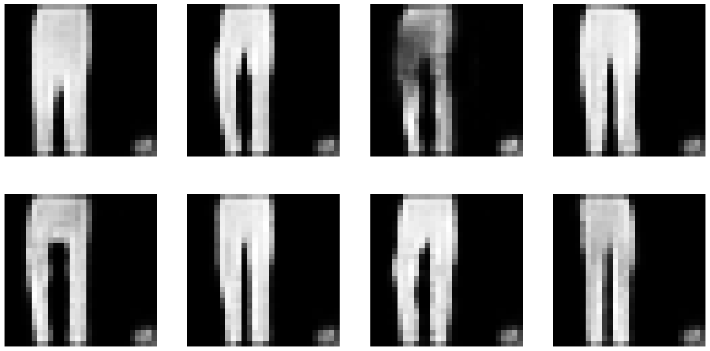

# Transfomer Meets VQVAE

- I currently practice deep learning to reproduce the original DALLE1 paper (https://arxiv.org/abs/2102.12092)
- this project serves as a tiny step towards that goal
  
- orignal VQVAE paper: https://arxiv.org/abs/1711.00937
- learned about VQVAE (how to implement it in PyTorch) here: https://www.youtube.com/watch?v=1ZHzAOutcnw

## Methodology

1. Train a VQVAE on Fashion MNIST (https://github.com/zalandoresearch/fashion-mnist)
- the VQVAE learns to reconstruct the images from a discrete latent representation
- the latent representation is a sequence of codebook vectors (in our case: 49 tokens and each token can be one of 64 symbols)
- reconstruction loss = MSE (additional losses for discretization)

Reconstructions:

Note: the MSE loss makes the reconstructions blurry (mentioned in the DALLE-1 paper). To get crisp images, we can replace it by an adversarial loss

- we add a start token to tell a transformer what class we want to generate (tokens = 64 + [0, 1, ..., 9])
- the token 74 (= 64 + 10) serves as the end token
  
## Training

| VQVAE Hyperparameters | Value |
|-----------------------------|-------|
| n_codebook_vectors        | 64   |
| codebook_vec_dim          | 16     |
| beta   |    0.25 |

- trained on 60k Fashion MNIST images (their bitmap representation)
- learning rate = 1e-3 (for first five episodes, then 3e-4)
- Adam optimizer
- batch size = 64
- epochs = 10 (training takes approx. 3 minutes on an RTX3060)

| Transformer Hyperparameters | Value |
|-----------------------------|-------|
| d_model                     | 256   |
| n_heads                     | 8     |
| n_layers                    | 8     |
| context_size                | 152   |
| p_dropout                   | 0.1   |

- trained on 60k Fashion MNIST images (their token representations given by the VQVAE)
- learning rate = 3e-4
- Adam optimizer
- batch size = 128
- epochs = 1 (training takes approx. 20 minutes on an RTX3060)

## Results

| Hyperparameters for Sampling  |          Details          |
|-------------------------------|---------------------------|
| Sequence Generation           | 8 sequences at the same time |
| Transformer Temperature       | 0.8                        |

- Inference time (8 generations): approx. 3s (on an RTX3060)

## Results

### T-shirt/top (0)

### Trouser (1)

### Pullover (2)

### Dress (3)

### Coat (4)

### Sandal (5)

### Shirt (6)

### Sneaker (7)

### Bag (8)

### Ankle Boot (9)

